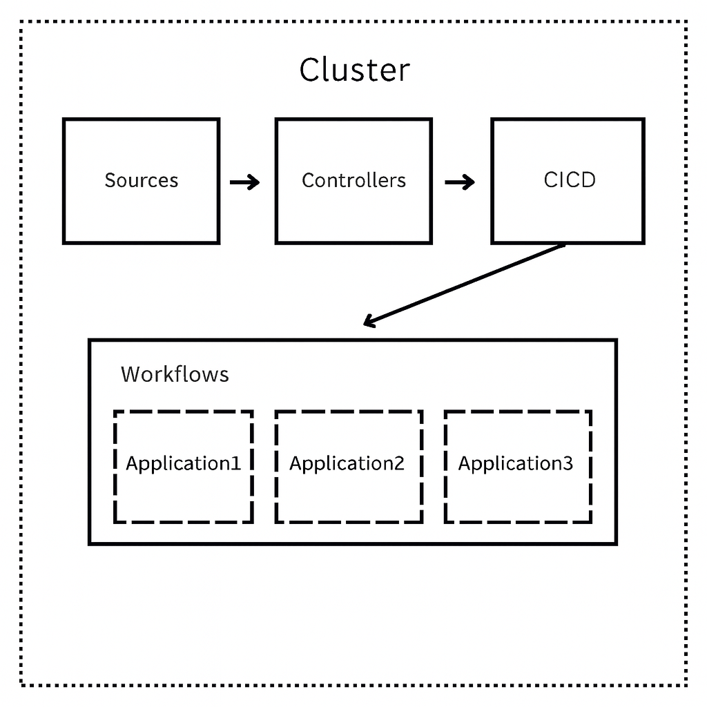

# GitOps Configuration

## About

Flux manages the state of our kubernetes clusters automagically.

## Config Layout

Our gitops directory structure is broken in to a number of dependent stages.




### Sources

The sources folder manages the installation of helm repositories which will be used in subsequent steps to install helm manifests.

Since the sources we install are the same in all environments, sources does not contain any overlay directories.  Each of the helm repository sources is defined in the sources/sources directory (a stage called sources that installs a kustomization called sources)

### Controllers

The controllers folder manages the installation of services or controllers that are pre-requisites for subsequent stages.

Flux will fail to syntax check yaml files for CRD's that are not installed yet, which requires that some dependencies be installed up front, most notably external secrets.

The controllers stage is broken into a base directory which contains all of the base/default definitions for the yaml's defined, and a series of directories named after each cluster/environment which contain environment specific values contained in overlays.

### CICD

The CICD folder manages the installation of argo, as well as any other services or resources that will be required to deploy Glorify applications.

The CICD stage's folder layout is the same as the controller stage, described above.

### clusters

The clusters folder is the target of the flux sync, and the beginning point for all execution.  Inside clusters is a folder for each environment that will contain an eks cluster.  These folders contain a yaml file for each stage that will be executed against this environment, as well as all the apps that will be deployed to this environments cluster.

## Adding a new application

As Argo and flux are disconnected, applications will go into the workloads directory. There are a couple of different ways this can be accomplished:
1. Simplest - traditional application file in the workloads directory - 
```yaml
apiVersion: argoproj.io/v1alpha1
kind: Application
metadata:
  #Update application name here
  name: authentication-api
  namespace: argo
  finalizers:
  - resources-finalizer.argocd.argoproj.io
spec:
  destination:
    namespace: devopsidiot
    server: https://kubernetes.default.svc
  project: default
  source:
    helm:
      parameters:
      # Does this service need to be externally accessible? Default: false
      - name: ingress.enabled
        value: "true"
      # Do you want the service to have an access control list? Default: false
      - name: ingress.acl.enabled
        value: "true"
      # Which ACL do you want to use?
      # vpnRegionalWhiteList - Accessible only while on VPN
      # publicBotControl - Accessible to Public with AWS Bot Control
      - name: ingress.acl.arn
        value: "vpnRegionalWhiteList"
      # Image should be updated by ImageUpdateAutomation, these are placeholders
      # The tags behind the placeholders should be updated for the location
      - name: image.name
        value: nginx # {"$imagepolicy": "flux-system:account-api-us-qa:name"}
      - name: image.tag
        value: stable # {"$imagepolicy": "flux-system:account-api-us-qa:tag"}
    targetRevision: devopsidiot-deployment-0.1.0
    repoURL: https://github.com/devopsidiot/helm-charts
    path: charts/deployment
  syncPolicy:
    automated:
      prune: true
      selfHeal: true

```
2. Developer Friendly - this will allow the developer the ability to iterate on values.yaml without having to involve Platform/DevOps/SRE:
```yaml
apiVersion: argoproj.io/v1alpha1
kind: Application
metadata:
  name: new-api-test
  namespace: argocd
  annotations:
    argocd-image-updater.argoproj.io/image-list: 174950171951.dkr.ecr.us-east-1.amazonaws.com/new-api
    argocd-image-updater.argoproj.io/new-api.helm.image-name: image.name
    argocd-image-updater.argoproj.io/new-api.helm.image-tag: image.tag
    argocd-image-updater.argoproj.io/allow-tags: regexp:develop-v.*
    argocd-image-updater.argoproj.io/update-strategy: newest-build
    argocd-image-updater.argoproj.io/pull-secret: ext:/scripts/ecr-login.sh
    argocd-image-updater.argoproj.io/git-repository: git@github.com:devopsidiot/interview-gitops.git
    argocd-image-updater.argoproj.io/write-back-method: git:secret:argo-image-updater/argocd-image-updater-git-creds
    argocd-image-updater.argoproj.io/write-back-target: "helmvalues:workloads/application/new-api-rnd.yaml"  #this will allow argo to write back to the gitops repository so git will be real time source of truth
    argocd-image-updater.argoproj.io/git-branch: rnd
  finalizers:
  - resources-finalizer.argocd.argoproj.io
spec:
  sources: #drawing from multiple sources
    - repoURL: http://chartmuseum.chartmuseum.svc:8080
      targetRevision: 0.1.56
      chart: world-eater
      helm:
        valueFiles:
        - $values/workloads/big-test/new-api-rnd.yaml  #this can reference a developer's repository so devs have full control over their application
    - repoURL: git@github.com:devopsidiot/interview-gitops.git  #example repo
      targetRevision: main
      ref: values
  destination:
    server: https://kubernetes.default.svc
    namespace: sandbox
  project: default
  syncPolicy:
    automated:
      prune:
      selfHeal:
```
3. Lastly, we can empower developer velocity by enabling preview environments:
```yaml
apiVersion: argoproj.io/v1alpha1
kind: ApplicationSet
metadata:
  name: special-app-previews
  namespace: argo
spec:
  generators:
    - pullRequest:
        github:
          owner: devopsidiot
          repo: content-service
          tokenRef:
            key: pat
            secretName: argocd-github
          labels:
          - special-app
        requeueAfterSeconds: 60
  template:
    metadata:
      name: 'preview-{{branch}}'
    spec:
      destination:
        namespace: 'preview-{{branch}}'
        server: 'https://kubernetes.default.svc'
      project: default
      source:
        chart: world-eater
        repoURL: http://chartmuseum.chartmuseum.svc:8080
        targetRevision: 0.1.48
        helm:
          parameters:
            {values yaml stuff}
          valuesObject:
            {more values stuff}
      syncPolicy:
        syncOptions:
          - CreateNamespace=true
        automated:
          prune: true
          selfHeal: true
